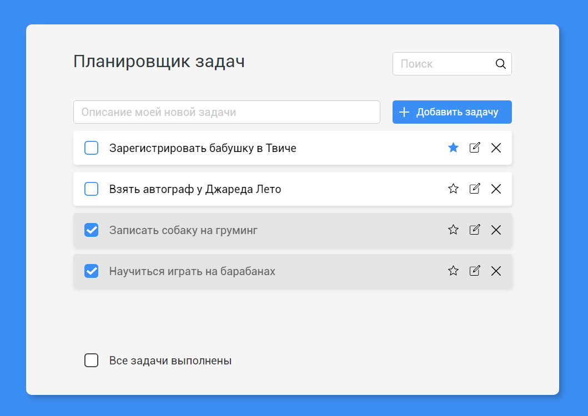

## Техническое задание:
1.  Суть задания: сделать хорошо работающий **Планировщик задач**, основываясь на референтной версии приложения или PNG макете;
2.  Добавлять задачи нужно через поле сверху («Описание моей новой задачи»), длинной не более `50 символов`;
3.  При нажатии на кнопку «Добавить задачу» или «Enter» поле ввода должно стать пустым, а новая задача добавиться в начало списка задач;
4.  Задачу с пустой строкой добавить нельзя;
5.  Порядок отображения задач:
    -  Приоритетные;
    -  Обычные;
    -  Выполненные.
6.  Задачу можно отметить как приоритетную, нажав на звёздочку. А также — как не приоритетную при повторном нажатии:
    -  При этом, приоритетная задача должна переместиться в самый верх списка (сперва приоритетные);
    -  А не приоритетная — обратно в список не приоритетных.
7.  Задачу можно отметить как выполненную, нажав на чекбокс слева, и как не выполненную при повторном нажатии:
    -  При этом, задачи, отмеченные как выполненные должны перемещаться в конец списка;
    -  При перемещении из выполненных в не выполненные задача должна располагаться после приоритетных — если задача не приоритетная, или вместе с остальными приоритетными — если задача приоритетная;
    -  Главное — сохранять консистентность групп задач, сохранять точное расположение внутри группы не обязательно, но желательно
8.  Текст задачи можно редактировать, нажав на карандашик, максимальная длинна сообщение — `50 символов`:
    -  При входе в режим редактирования ввод пользователя должен сфокусировать на элементе `<input />`;
    -  При повторном нажатии на клавишу `Enter`, новый текст задачи должен сохраниться в состоянии, а режим редактирования выключится;
    -  При нажатии на `Escape`, или при повторном нажатии на карандашик текст задачи должен вернуться в исходное состояние, до входа в режим редактирования, а режим редактирования должен выключиться.
9.  Задачу можно удалить, нажав на крестик;
10.  При нажатии на чекбокс «Все задачи выполнены», все задачи должны быть отмечены как выполненные (отмечать задачи как «все не выполненные» в обратную сторону не нужно);
11.  При вводе сообщения в поле «Поиск», задачи должны фильтроваться;
12.  Анимировать добавление и удаление задач;
13.  Анимировать перемещение задач в приоритетные, выполненные и обратно.
14.  Первые 2 секунды, нужно вместо приложения показывать "spinner".

## Внешний вид:
